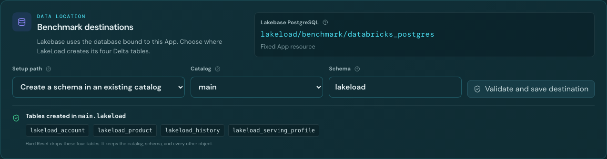
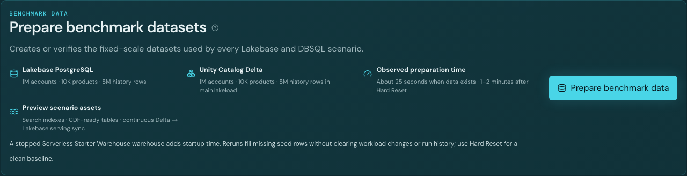
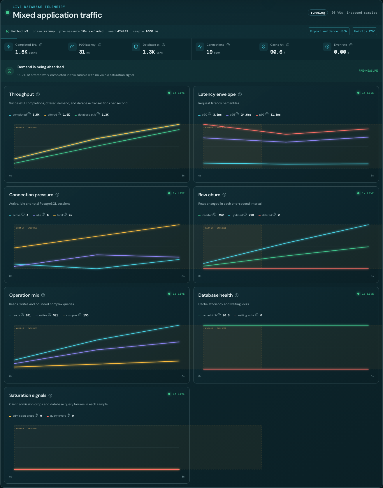
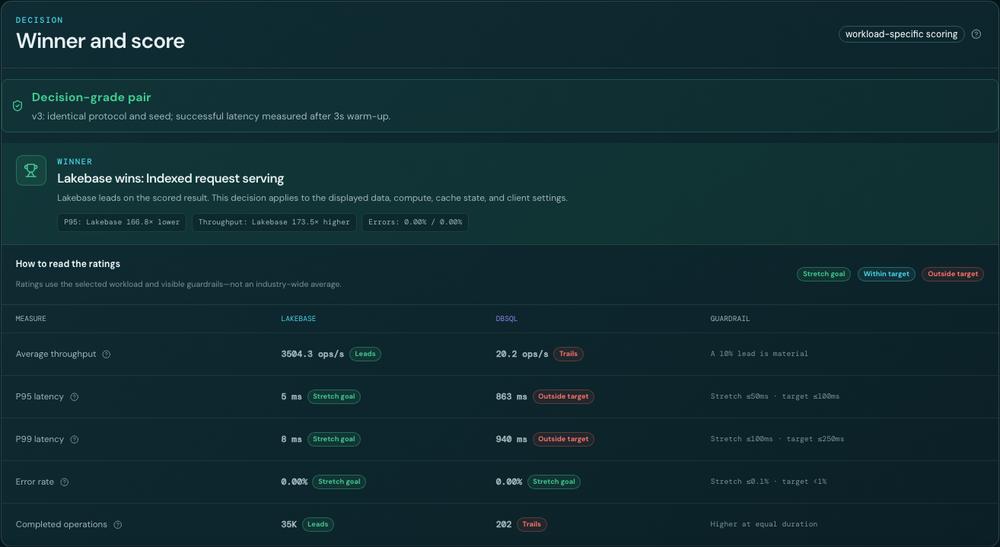
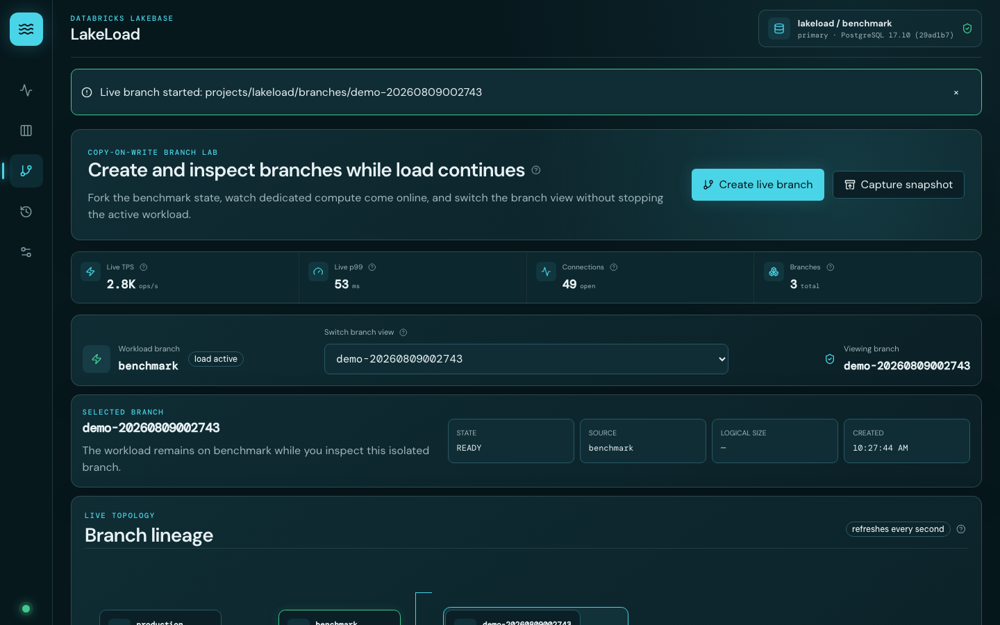

# LakeLoad quickstart

This guide takes a new workspace from the GitHub repository to a first Lakebase run, an engine comparison, and a live branch demonstration.

## 1. Check prerequisites

You need:

- a Databricks workspace with Databricks Apps and Lakebase Autoscaling;
- permission to create a Lakebase project and Databricks App;
- an authenticated Databricks CLI profile;
- `CAN USE` on a SQL warehouse;
- a Unity Catalog catalog where the App service principal can use an existing schema or create one;
- Node.js 22+, Python 3.10+, and `databricks-sdk`.

## 2. Install from GitHub

```bash
git clone https://github.com/althrussell/databricks-lakeload.git
cd databricks-lakeload
npm ci
python scripts/bootstrap.py \
  --profile <PROFILE> \
  --warehouse <WAREHOUSE_ID> \
  --catalog <CATALOG>
```

The installer creates or reuses the Lakebase project, creates the isolated `benchmark` branch and compute, deploys the App and jobs, binds the warehouse, and grants the App service principal the required resource access. It prints the App URL when deployment finishes.

## 3. Select the data destinations

Open the App and select **Settings**.

1. Under **Benchmark destinations**, choose one setup path:
   - **Use an existing schema** when the App service principal already has `USE CATALOG`, `USE SCHEMA`, and `CREATE TABLE`.
   - **Create a schema in an existing catalog** when catalog creation is restricted.
   - **Create a catalog and schema** only when the App service principal has `CREATE CATALOG`.
2. Choose the catalog and schema.
3. Select **Validate and save destination**. LakeLoad creates and removes a permission-check table before saving.
4. Under **SQL warehouse under test**, choose the warehouse and select **Use for DBSQL tests**.



## 4. Prepare the benchmark data

Select **Prepare benchmark data**. Keep the page open while preparation runs.

Preparation creates or verifies:

- 1 million accounts, 10,000 products, and 5 million history rows in Lakebase;
- matching Delta tables in the selected Unity Catalog schema;
- CDF-ready tables and the continuous synced-table source;
- available Search and query-statistics assets.

An idempotent rerun is faster because existing rows are retained. After Hard Reset, allow approximately 1–2 minutes; actual duration depends on warehouse startup and workspace capacity.



## 5. Run the first Lakebase workload

1. Select **Live telemetry** in the navigation rail.
2. Select **Lakebase** and **Indexed point lookup**.
3. Set **Concurrent users** to `10`, **Duration** to `30 sec`, **Ramp** to `5 sec`, and **Warm-up** to `5 sec`.
4. Keep **Closed loop** selected.
5. Select **Simulate load**.
6. Watch completed TPS, p50/p95/p99 latency, connections, row churn, cache hit, lock waits, and errors update every second.
7. Hover a chart for an exact sample. Keyboard users can focus a chart and use Left/Right Arrow.



## 6. Compare Lakebase and DBSQL

1. Select **Compare engines**.
2. Choose **Indexed request serving**.
3. Use **1 pass** for a demo or **3-pass evidence** before quoting a result.
4. Select **Run matched comparison**.
5. Read **Winner and score** first, then validate throughput, p95, p99, errors, guardrails, and the two timelines.

LakeLoad only calls a pair decision-grade when the method, seed, scale, concurrency, duration, ramp, and warm-up match.



## 7. Demonstrate branching under load

1. Start **Mixed application traffic** for at least 60 seconds.
2. Select **Open Branch Lab** beside **Stop load**.
3. Select **Create live branch**.
4. Wait for the `demo-*` branch and its dedicated compute to become ready.
5. Use **Switch branch view** or the topology nodes to inspect `production`, `benchmark`, the demo branch, snapshots, and restores.
6. Confirm **Workload branch** remains `benchmark · load active` while the selected branch changes.
7. Optionally select **Capture snapshot**, choose the snapshot node, and select **Restore isolated branch**.

Switching the view does not move already-open PostgreSQL sessions. The active run remains connected to `benchmark`.



## 8. Finish safely

- Select **Stop load** before changing destinations or warehouses.
- Remove disposable `demo-*` and `restore-*` branches with their trash actions.
- Use **Hard reset** only when you want to delete all LakeLoad test data and history. It requires the exact phrase `RESET LAKELOAD`.
- Hard Reset preserves the project, `production`, `benchmark`, App deployment, catalog, schema, non-LakeLoad tables, and selected warehouse.

Next: read the [full user guide](user-guide.md) for every feature or the [customer replication guide](customer-guide.md) for permissions, preview configuration, benchmark methodology, and API automation.
