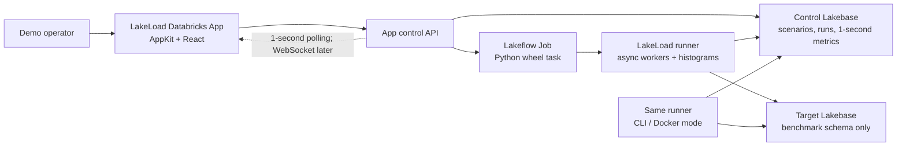
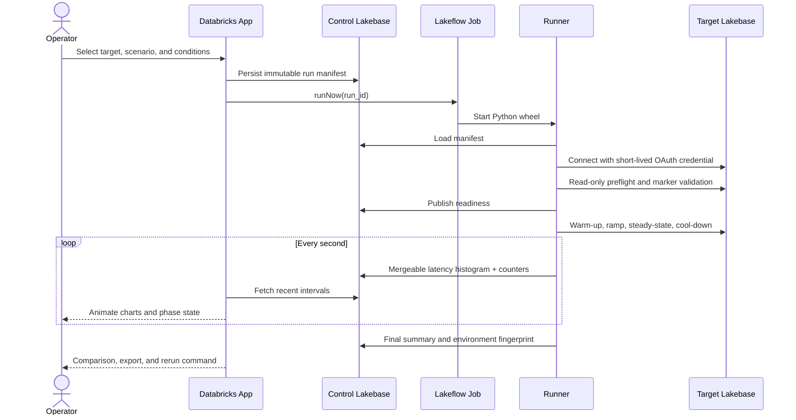

# LakeLoad: end-to-end solution plan

## 1. Executive recommendation

Build **LakeLoad** as a Databricks App that controls repeatable PostgreSQL workload runs against Lakebase and visualizes results within roughly one second.

The recommended shape is:

- **Databricks AppKit + React** for the polished control and results experience.
- **A dedicated control Lakebase project** for scenarios, run state, interval metrics, and comparisons.
- **A separate target Lakebase project or branch** that receives benchmark traffic. Never store control telemetry in the target being measured.
- **A Python workload engine** based on standard PostgreSQL tooling: `psycopg` 3, SQL, YAML/JSON scenarios, and HDR histograms.
- **Lakeflow Jobs** as the zero-external-infrastructure runner. The same Python package also ships as a Docker image/CLI for customer laptops, VMs, or Kubernetes.
- **Declarative Automation Bundles** for the App and Job, plus an idempotent bootstrap command for Lakebase resources and grants.

The App is the control plane, not the load generator. Running a meaningful benchmark inside a Databricks App would mix benchmark pressure with UI availability and constrain the generator to the App's 2–4 vCPUs.

## 2. Goals and non-goals

### Goals

1. Demonstrate Lakebase throughput, latency, concurrency, autoscaling, scale-to-zero, read replicas, and branching under understandable conditions.
2. Support point reads, writes, multi-statement transactions, bounded joins, aggregations, locking, and mixed workloads.
3. Show live throughput, latency percentiles, errors, connections, and workload phase changes.
4. Make every run reproducible from a saved scenario, data seed, target configuration, runner version, and immutable run manifest.
5. Deploy into a customer workspace without proprietary test infrastructure.
6. Keep credentials ephemeral and prevent accidental load against an unapproved database.

### Non-goals for the first release

- Replacing full benchmark suites such as TPC-C certification or HammerDB.
- Treating large unbounded analytical scans as an OLTP best practice; those belong on the Databricks Lakehouse.
- Claiming cross-customer benchmark comparability. Network location, dataset size, cache state, endpoint sizing, and client compute must accompany every result.
- Provisioning customer networking or changing production endpoints without explicit operator confirmation.

## 3. Architecture



| Component            | Responsibility                                                                  | Recommended implementation                                   |
| -------------------- | ------------------------------------------------------------------------------- | ------------------------------------------------------------ |
| Web client           | Configure, launch, monitor, compare, and export runs                            | AppKit, React, TypeScript, AppKit UI/ECharts                 |
| App server           | Validate requests, persist manifests, trigger/cancel Jobs, serve metric windows | AppKit server + Lakebase and Jobs plugins                    |
| Control database     | Durable scenarios, run state, events, interval histograms, summaries            | Dedicated Lakebase Autoscaling project/database              |
| Built-in runner      | Execute benchmark without external customer infrastructure                      | Lakeflow Job running the Python wheel                        |
| Portable runner      | Run near the target or from a customer-controlled network                       | Same wheel exposed as CLI and OCI image                      |
| Target database      | Receive only the measured traffic                                               | Separate Lakebase project or approved branch/schema          |
| Bootstrap/deployment | Create resources, grant identities, deploy App/Job                              | Databricks SDK/CLI bootstrap + Declarative Automation Bundle |

### Why two databases

Writing live metrics into the database under test distorts the result and can make the UI disappear precisely when the target is saturated. The control Lakebase remains small and steady: each runner shard writes one aggregated histogram/status record per second, not one row per transaction.

## 4. End-to-end run lifecycle



Run phases are explicit: **preflight → optional data preparation → warm-up → ramp → steady state → cool-down → finalize**. Warm-up is excluded from the headline result unless the scenario explicitly measures cold-start behavior.

## 5. Workload engine

### Execution models

- **Closed loop / virtual users:** each user issues a transaction, optionally thinks, then issues the next. Best for concurrency and application-like behavior.
- **Open loop / target rate:** arrivals occur at a configured rate even when latency rises. Best for identifying saturation and queueing.

Connection behavior is a first-class scenario setting:

- `session`: one persistent connection per virtual user.
- `pool`: many virtual users share a bounded connection pool.
- `churn`: connections are repeatedly established to demonstrate connection overhead; this is a short, clearly labelled test.

Use `psycopg` 3 for PostgreSQL access. Lakebase OAuth database credentials are minted with `WorkspaceClient().postgres.generate_database_credential(endpoint=...)`, used only in memory, and never written to the control database or logs. All connections use `sslmode=require`. Connection factories mint fresh credentials for new/recycled physical connections.

### Built-in workload packs

#### `pgbench-classic`

A schema- and transaction-compatible baseline that customers can cross-check with the standard PostgreSQL `pgbench` utility:

- account balance lookup
- account transfer transaction
- teller/branch/history updates
- select-only and mixed modes

This is the credibility anchor and quickest route to repeatability.

#### `retail-mixed`

A demo-friendly workload with deterministic synthetic customers, products, inventory, orders, order items, and payments:

| Operation         | Type               | What it demonstrates                                   |
| ----------------- | ------------------ | ------------------------------------------------------ |
| Product lookup    | Point read         | Indexed low-latency read                               |
| Customer profile  | Bounded join       | Multi-table lookup                                     |
| Place order       | Transaction        | Inserts, stock update, constraints, rollback           |
| Order history     | Join + aggregation | Bounded operational query                              |
| Inventory reserve | Contended update   | Locking and hot-key behavior                           |
| Regional summary  | Bounded aggregate  | Complex SQL without pretending Lakebase is a warehouse |

Ship presets such as `read-heavy`, `write-heavy`, `mixed-oltp`, `hot-key-contention`, and `complex-operational`.

### Scenario contract

Store scenarios as versioned YAML in Git and as validated JSON in the control database. The contract includes:

- API version, name, description, workload pack, scale, and deterministic seed
- closed/open-loop model, connection mode, pool size, and shard count
- bounded phases with duration, target concurrency/rate, and measurement inclusion
- weighted operation mix totaling 100%
- connection/statement timeouts, retry policy, and think time
- guardrails such as maximum error percentage and stop-on-p99 threshold

Validate it with JSON Schema/Pydantic in Python and Zod in the App.

### Conditions to compare

Every result records:

- endpoint/branch identity and PostgreSQL version
- autoscaling minimum/maximum CU and scale-to-zero state
- primary versus read replica
- dataset pack, scale, row counts, seed, index profile, and schema version
- concurrency/rate, connection mode, pool size, query mix, and think time
- runner mode/location, shard count, package version, and Git commit
- start time, warm-up policy, duration, timeouts, and retry policy

Recommended showcase sequence:

1. **Concurrency sweep:** 1 → 10 → 50 → 100 → 250 → 500 users.
2. **Autoscaling comparison:** economical versus performance-oriented min/max CU ranges.
3. **Cold versus warm:** scale-to-zero wake-up followed by a warm repeat.
4. **Query design:** identical branch snapshot with baseline versus improved index profile.
5. **Read scaling:** eligible read-heavy scenario on primary versus read replica.

## 6. Metrics and statistical correctness

### Authoritative runner metrics

- attempted, completed, succeeded, and failed transactions/queries
- transactions or queries per second
- p50, p90, p95, p99, p99.9, min, max, and mean latency
- connection acquisition/creation latency
- active virtual users, physical connections, pool queue depth, and target arrival rate
- errors grouped by SQLSTATE, timeout, connection failure, and application category
- retries, rollbacks, rows read/written, and phase transitions

Use interval HDR histograms per worker and merge them server-side. Do not calculate a global p99 by averaging worker p99 values.

Sample standard PostgreSQL views at a low rate for diagnostic context: `pg_stat_activity`, `pg_stat_database`, `pg_locks`, and `pg_stat_statements` only when confirmed available and enabled. The first release should not promise live CU utilization unless the selected environment exposes a supported metric; configured min/max CU and endpoint status can always be shown.

Headline statistics use steady-state intervals by default. Incomplete shards, clock skew, or missing intervals visibly mark a run degraded. Exports include interval data for independent recalculation.

## 7. Control database design

Use an app-owned schema such as `lakeload_control`; do not use `public`.

| Table           | Purpose                                                                    |
| --------------- | -------------------------------------------------------------------------- |
| `scenario`      | Versioned reusable definitions and validation status                       |
| `run`           | Immutable manifest, lifecycle state, target fingerprint, actor, Job run ID |
| `run_shard`     | Runner identity, heartbeat, state, and clock-offset diagnostics            |
| `run_metric_1s` | Per-second mergeable histogram plus counters by shard/operation            |
| `run_event`     | Phase changes, warnings, errors, cancellations, endpoint events            |
| `run_summary`   | Final operation-level and overall aggregates                               |
| `target`        | Approved target metadata and safety policy; never a credential             |

Keep summaries/manifests indefinitely by default, retain interval metrics for 30 days, and allow export before cleanup.

## 8. Target dataset and safety model

The target uses a dedicated `lakeload` schema with a marker table containing the dataset pack, seed, schema version, and creation identity.

1. Refuse data preparation, truncation, or mutation unless the marker exists and matches the requested pack.
2. Never accept an unqualified table name or arbitrary cleanup SQL from the UI.
3. Prefer an ephemeral Lakebase branch for demos and CI. Protect the production branch.
4. Reserve connection headroom; default requested connections to no more than 80% of the endpoint limit.
5. Cap default run duration at 10 minutes and require elevated confirmation for longer/high-CU runs.
6. Confirm endpoint sizing, scale-to-zero, branch reset, or other cost/destructive changes.
7. Provide a prominent cancel action; the App cancels the Job and runners handle termination signals cleanly.

Dataset creation is deterministic and idempotent. For clean A/B tests, prepare once and branch from the same snapshot rather than reseeding two independently timed environments.

## 9. Databricks App experience

### Navigation

1. **Run** — configured endpoint status, scenario preset, advanced controls, phased ramp preview, safety summary, launch.
2. **Live** — real-time status and operator controls.
3. **Compare** — select compatible runs and explain configuration differences.
4. **History** — searchable run ledger, tags, notes, exports, and rerun.
5. **Admin** — approved targets, runner health, retention, and permissions.

### Live run screen

```text
┌ LakeLoad ─ Mixed OLTP / 500 users ─ STEADY ─ 01:42 ───── [Stop] ┐
│  12,480 TPS     18 ms p50      64 ms p95     143 ms p99   0.08% │
├──────────────────────────────────┬───────────────────────────────┤
│ Throughput + concurrency         │ Latency percentiles           │
│ animated time series             │ p50 / p95 / p99               │
├──────────────────────────────────┼───────────────────────────────┤
│ Operation mix and per-op TPS     │ Errors / connections / queue  │
├──────────────────────────────────┴───────────────────────────────┤
│ WARMUP ───── RAMP ─────────────── STEADY ─────────── COOLDOWN    │
│ Live events: config • worker ready • threshold warning           │
└──────────────────────────────────────────────────────────────────┘
```

### Visual direction

- Dark, high-contrast operations-console shell with restrained Databricks red, cyan, and indigo accents.
- Large numeric KPIs with stable widths; color encodes state rather than decoration.
- Smooth one-second interpolation so polling feels live without implying false sub-second precision.
- Consistent latency units and logarithmic chart options where useful.
- Phase bands on every time-series chart and annotations for configuration changes/errors.
- Skeletons, empty states, and graceful degraded-run messaging.
- Responsive but optimized for a 1440px presentation screen.
- WCAG AA contrast; never rely on red/green alone.

Use AppKit UI/ECharts in data mode for Lakebase-fetched metrics. Lakebase reads go through server routes; do not use Analytics queries or a SQL warehouse for this App.

### Real-time transport

Use short-lived HTTP polling every second for MVP. It is reliable behind the Databricks Apps proxy, avoids the 120-second request limit, and is sufficient for one-second metric buckets. Add WebSockets only if a later spike proves materially smoother. Do not hold a long SSE request open for an entire benchmark.

## 10. Identity, permissions, and secrets

Use distinct identities where possible:

- **App service principal:** owns `lakeload_control`, reads/writes control data, and has `CAN_MANAGE_RUN` on the load Job.
- **Job run identity:** performs target database preflight, connects to approved control/target databases, and accesses only the required benchmark/control schemas.
- **Optional endpoint manager:** changes endpoint/branch settings. Keep this separate from default runner permission and enable it only for managed demo environments.

The Databricks App resource declarations grant the App service principal the declared resource permissions. Deploy the App before local schema development so its service principal creates and owns the custom control schema.

Use the authenticated proxy identity for run attribution. Database credentials are short-lived, minted at runtime, redacted from exceptions, and never persisted. Store no PostgreSQL password or OAuth token in a scenario, URL, control table, or export.

## 11. Deployment and repository structure

```text
databricks-lakeload/
├── databricks.yml
├── resources/
│   ├── app.yml
│   └── load-job.yml
├── app/
│   ├── client/src/
│   ├── server/
│   ├── tests/
│   └── app.yaml
├── runner/
│   ├── src/lakeload/
│   ├── scenarios/
│   ├── sql/
│   ├── tests/
│   ├── pyproject.toml
│   └── Dockerfile
├── bootstrap/
│   └── setup.py
├── docs/
└── .github/workflows/
```

### Bootstrap order

1. Verify a supported Databricks CLI and let the operator explicitly select an authenticated profile.
2. Create or select the control Lakebase project, production branch, database, and endpoint.
3. Deploy the App once so its service principal exists and owns `lakeload_control`.
4. Deploy the Lakeflow Job and grant its run identity minimum control/target schema access.
5. Register an approved target, run read-only preflight checks, and initialize an ephemeral benchmark branch/schema.
6. Validate and deploy with a Declarative Automation Bundle for `dev`, `staging`, and `prod` targets.
7. Run AppKit Playwright smoke tests and a small five-user performance smoke test.

The bootstrap command is safe to rerun and reports every created/reused resource. Destructive cleanup is a separate, explicitly confirmed command.

### Customer repeatability

Offer two paths backed by the same runner package:

- `databricks bundle deploy -t dev` plus the built-in Lakeflow Job: the guided path with no customer-managed compute.
- `docker run ... lakeload run scenario.yml`: for a generator in a particular network or familiar container tooling.

Also emit a standard `pgbench` command and script for the `pgbench-classic` pack so customers can cross-check the baseline independently.

## 12. Delivery plan

### Phase 0 — technical spikes (3–5 days)

- Verify AppKit manifest/resource shapes for Lakebase + Jobs in the selected workspace.
- Confirm App service-principal schema ownership and Job identity grants end to end.
- Establish practical concurrency from one serverless Python wheel task; test sharding only if needed.
- Validate supported PostgreSQL statistics/extensions.
- Prove one-second metric polling and chart updates.
- Measure cold Job startup and decide whether a pre-warmed demo runner is worth the cost.

**Exit:** one button starts a 60-second workload and produces live TPS/p95 in the App.

### Phase 1 — vertical-slice MVP (1–2 weeks)

- App shell, target preflight, presets, launch/cancel, live KPIs, two charts, history.
- Control schema and lifecycle state machine.
- Python runner with closed-loop model, ramp phases, mergeable histograms, retries, and graceful shutdown.
- `pgbench-classic` plus three `retail-mixed` operations.
- Bundle, bootstrap, unit/integration tests, and a dev environment.

**Exit:** a customer can deploy, seed, run, monitor, export, and exactly rerun a benchmark.

### Phase 2 — demo-quality release (1–2 weeks)

- Complete retail workload and open-loop model.
- A/B comparisons, annotations, operation breakdown, downloadable manifest/CSV/JSON.
- Endpoint presets, branch-based index comparison, cold/warm workflow, and optional read replica scenario.
- Presentation polish, responsive layouts, accessibility, error/degraded states, and guided narrative mode.
- Docker/CLI runner and pgbench cross-check instructions.

**Exit:** a field team can run the five-part showcase sequence without editing code.

### Phase 3 — hardening (1 week)

- Multi-shard runner if Phase 0 proves it necessary.
- Retention/pruning, audit coverage, permission tests, failure injection, and upgrade documentation.
- CI on scenario schemas, runner tests, App type/lint/smoke tests, and bundle validation.
- Customer runbook, troubleshooting guide, and benchmark interpretation guide.

Indicative team: two engineers for 4–6 weeks, with a design review during Phase 1 and field feedback during Phase 2.

## 13. Acceptance criteria

1. A fresh customer environment can follow documented bootstrap/deploy steps without manual source edits.
2. A run manifest captures enough information to reproduce the workload and explain environmental differences.
3. Live charts update within two seconds of a metric bucket being committed.
4. Global latency percentiles are computed from merged histograms, not averaged percentiles.
5. Cancellation stops new work promptly and preserves a clearly marked partial result.
6. No credential appears in control tables, browser payloads, exports, or normal logs.
7. The runner refuses mutations outside a correctly marked benchmark schema.
8. Results distinguish warm-up, measured, incomplete, and degraded intervals.
9. The same `pgbench-classic` dataset can be exercised by LakeLoad and standard `pgbench`.
10. App validation, Playwright smoke tests, runner tests, a five-user smoke run, and bundle validation pass in CI.

## 14. Principal risks and mitigations

| Risk                                              | Mitigation                                                                                  |
| ------------------------------------------------- | ------------------------------------------------------------------------------------------- |
| Lakeflow Job cold start weakens a live demo       | Preflight early; show readiness state; optionally keep a warm demo runner for presentations |
| Generator becomes the bottleneck                  | Record runner CPU/event-loop lag; calibrate in Phase 0; shard only after evidence           |
| Metrics contaminate target performance            | Use a dedicated control Lakebase and one-second aggregated writes                           |
| Too many connections destabilize target           | Read endpoint limits, reserve headroom, cap duration/concurrency, require confirmations     |
| OAuth expires during long/churn tests             | Mint Lakebase-scoped credentials in the connection factory and recycle before expiry        |
| Complex queries imply wrong positioning           | Keep them bounded/operational; position unbounded analytics on the Lakehouse                |
| Network distance dominates latency                | Record runner mode/location and show it beside every comparison                             |
| Database stats differ by environment              | Feature-detect optional extensions; runner metrics remain authoritative                     |
| Branch/endpoint actions are costly or destructive | Separate manager privilege, protect production, preview, audit, and confirm                 |

## 15. Decisions to lock after Phase 0

1. Maximum concurrency from a single built-in runner before distributed sharding is required.
2. Whether the presentation profile uses an ephemeral or pre-warmed runner.
3. Which supported Lakebase database statistics and endpoint metrics can be shown consistently.
4. Default dataset scale and duration that finish quickly while creating visible autoscaling behavior.
5. Whether endpoint resizing is enabled in the App or remains an operator pre-step for the first release.
