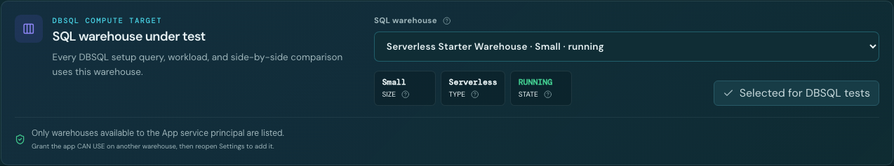
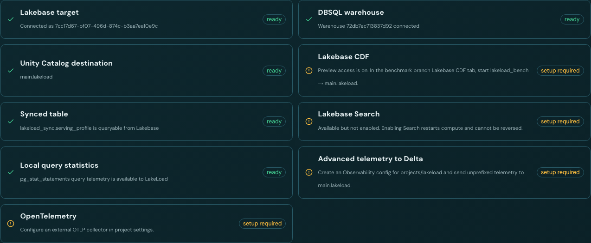
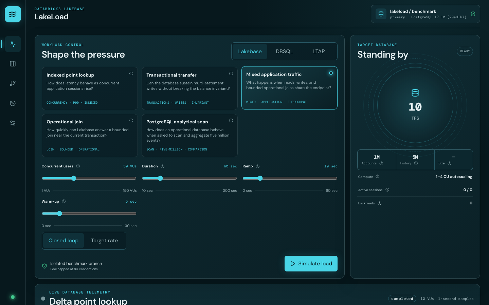
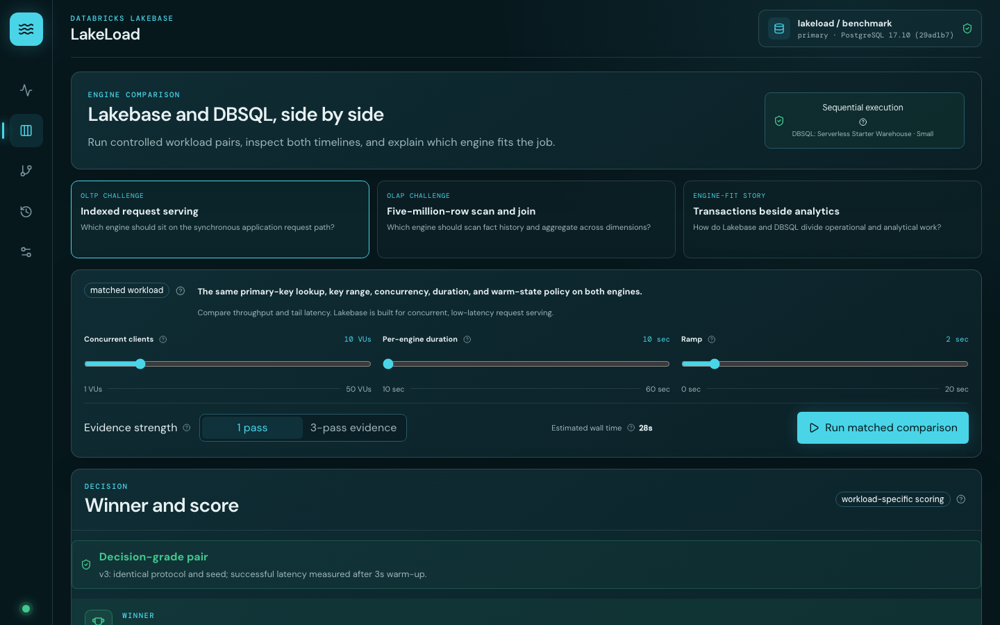
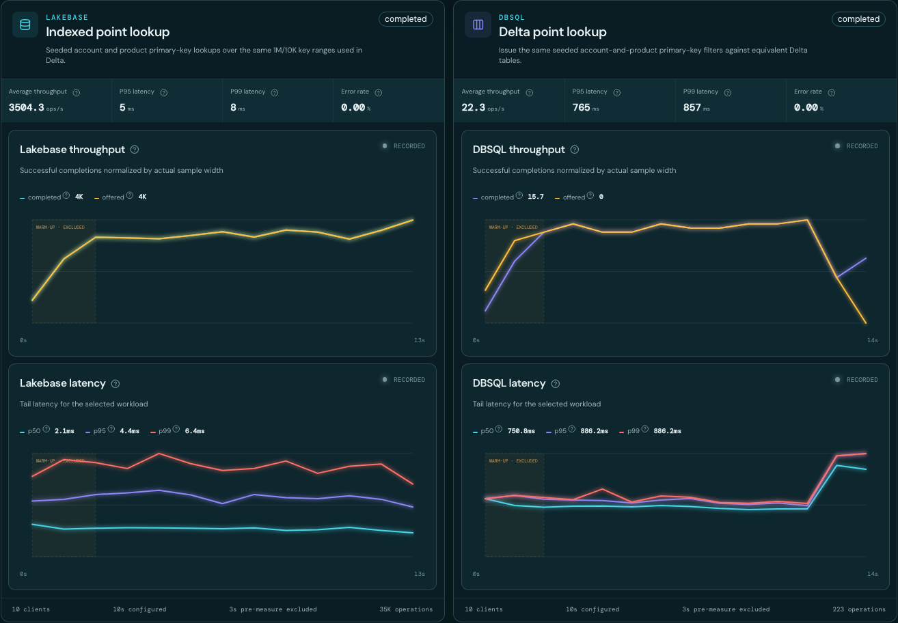
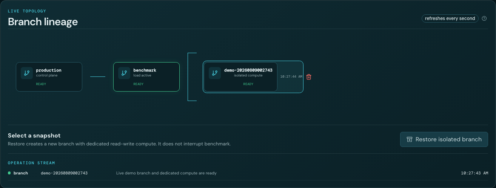
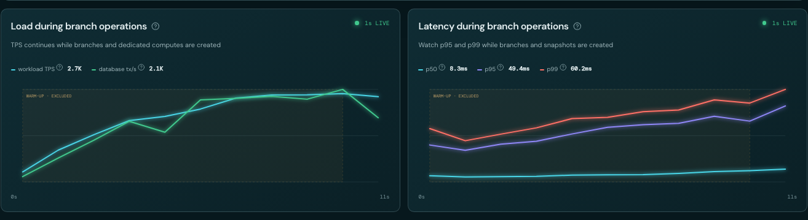
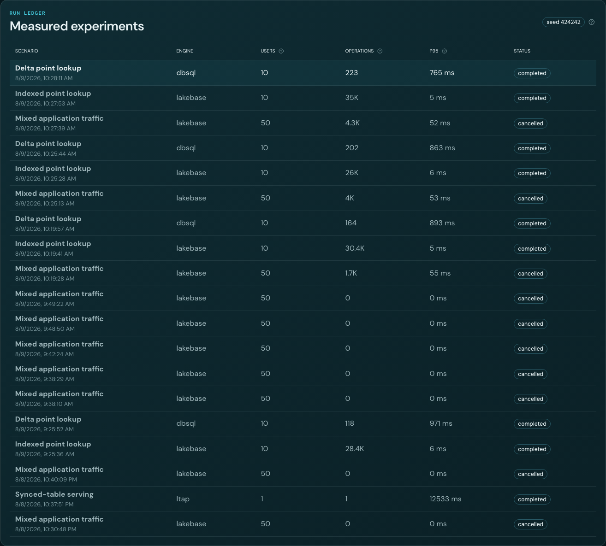
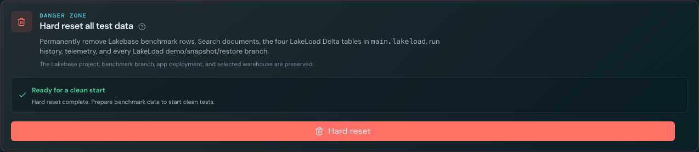
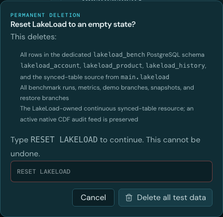

# LakeLoad user guide

LakeLoad is a Databricks App for demonstrating Lakebase OLTP, DBSQL OLAP, and bidirectional LTAP with repeatable workloads and one-second evidence. This guide explains every operator-facing surface.

> Screenshot values come from the shared `labs` environment and illustrate the interface. They are not product performance claims or service-level objectives.

## Navigation

The left rail contains five work areas:

| Icon destination    | Purpose                                                                                                |
| ------------------- | ------------------------------------------------------------------------------------------------------ |
| **Live telemetry**  | Select an engine and workload, shape pressure, start or stop load, and inspect live metrics.           |
| **Compare engines** | Run controlled Lakebase and DBSQL workload pairs and explain the result.                               |
| **Branch lab**      | Create, switch the view between, snapshot, restore, and remove isolated Lakebase branches during load. |
| **Run history**     | Reopen measured runs and their recorded metrics.                                                       |
| **Settings**        | Prepare data, choose destinations and DBSQL compute, inspect readiness, and reset the environment.     |

Hover or focus a rail icon to see its name and purpose.

## Configure the environment

Open **Settings** before the first run.

### Prepare benchmark data

The preparation panel states what will be created and the expected duration. Select **Prepare benchmark data** to create missing rows and preview assets without deleting existing run history or workload changes.

Preparation verifies:

- Lakebase PostgreSQL: 1 million accounts, 10,000 products, and 5 million history rows;
- Unity Catalog Delta: matching tables in the configured destination;
- Search indexes when the project feature is enabled;
- `REPLICA IDENTITY FULL` for Lakebase CDF sources;
- Delta CDF and continuous Delta-to-Lakebase synced-table provisioning;
- local PostgreSQL query-statistics support.

Use **Hard reset** when you need a clean baseline. Re-running Prepare is intentionally idempotent.

### Choose benchmark destinations

Lakebase is a fixed App resource. The destination form controls where LakeLoad creates its four Delta tables for DBSQL and LTAP tests.

Choose the least-privileged path that matches the customer workspace:

1. **Use an existing schema** — select a catalog and schema the App service principal can already use.
2. **Create a schema in an existing catalog** — select an approved catalog and provide a new schema name.
3. **Create a catalog and schema** — provide both names; this requires `CREATE CATALOG`.

Select **Validate and save destination**. Validation creates and removes a temporary table. LakeLoad then limits itself to:

- `lakeload_account`
- `lakeload_product`
- `lakeload_history`
- `lakeload_serving_profile`

Hard Reset can remove those four tables but never drops the enclosing catalog or schema.

### Choose the SQL warehouse

Every DBSQL preparation query, workload, notebook comparison, and side-by-side test uses the warehouse selected here.

1. Open the **SQL warehouse** list.
2. Review size, type, and state.
3. Select **Use for DBSQL tests**.

Only warehouses available to the App service principal are listed. Grant the App service principal `CAN USE`, then reopen Settings to add another warehouse. A stopped non-serverless warehouse can add startup latency that must be labelled in benchmark evidence.

### Read capability readiness

Readiness combines live resource, permission, extension, and data probes. Workspace preview access alone is not reported as ready.

| State              | Meaning                                                                               | Action                                     |
| ------------------ | ------------------------------------------------------------------------------------- | ------------------------------------------ |
| **ready**          | LakeLoad successfully exercised the required dependency.                              | Run the scenario.                          |
| **setup required** | The workspace exposes the feature but a project or external configuration is missing. | Follow the exact remediation in the card.  |
| **blocked**        | A required resource or permission cannot be reached.                                  | Correct the binding or grant, then reload. |

CDF, Search, advanced telemetry, and OpenTelemetry include administrator-controlled or irreversible steps. LakeLoad detects them but does not enable them silently.

## Build and run a workload

The workload control keeps the question, pressure model, safety boundary, and target database visible together.

### 1. Select an engine

- **Lakebase** — OLTP point reads, transactions, mixed traffic, bounded joins, and the matched PostgreSQL analytical challenge.
- **DBSQL** — Delta point lookup, five-million-row scan/join, and analytical window scenarios.
- **LTAP** — Lakebase CDF freshness, synced-table serving freshness, and the closed-loop enrichment path when their readiness checks pass.

### 2. Select a scenario

Each card names the question being tested. The method, scale, default controls, and expected engine fit are stored in the immutable run manifest.

### 3. Shape pressure

| Control              | Meaning                                                                                                                                            |
| -------------------- | -------------------------------------------------------------------------------------------------------------------------------------------------- |
| **Concurrent users** | Maximum active virtual users or in-flight requests.                                                                                                |
| **Duration**         | Configured run duration.                                                                                                                           |
| **Ramp**             | Time used to increase pressure to its configured level.                                                                                            |
| **Warm-up**          | Visible pre-measurement time excluded from headline results.                                                                                       |
| **Closed loop**      | Each virtual user sends its next request after the previous request completes. Use this for concurrency response curves.                           |
| **Target rate**      | The scheduler attempts a requested arrival rate independently of response completion. Use this to reveal queuing, admission drops, and saturation. |

Target-rate tests distinguish offered work, successful completions, client admission drops, and engine query errors. Do not describe a client-side admission ceiling as a database error.

### 4. Start and stop

Select **Simulate load**. While a run is active, the primary action becomes **Stop load**, and **Open Branch Lab** appears beside it. Stopping retains the run manifest and recorded samples.

## Read live telemetry

Every graph uses the same approximately one-second stream. Each sample records its actual interval width so rates remain correct when a diagnostic query or polling interval takes slightly longer.

### Headline metrics

| Metric            | Interpretation                                                                             |
| ----------------- | ------------------------------------------------------------------------------------------ |
| **Completed TPS** | Successful workload completions divided by actual sample width.                            |
| **P99 latency**   | Nearest-rank tail latency of successful requests observed by the load generator.           |
| **Database tx/s** | PostgreSQL commits plus rollbacks; endpoint context rather than an exact workload counter. |
| **Connections**   | Total PostgreSQL sessions for the benchmark database.                                      |
| **Cache hit**     | PostgreSQL shared-buffer hit ratio.                                                        |
| **Error rate**    | Failed workload operations divided by all attempted operations.                            |

### Graphs

- **Throughput** — completed demand, offered demand, and database transactions.
- **Latency envelope** — p50, p95, and p99.
- **Connection pressure** — active, idle, and total sessions.
- **Row churn** — inserted, updated, and deleted row deltas.
- **Operation mix** — reads, writes, and bounded complex queries.
- **Database health** — cache hit and waiting locks.
- **Saturation signals** — admission drops and engine query errors.
- **LTAP boundary latency** — PostgreSQL-to-Delta, DBSQL enrichment, and Delta-to-PostgreSQL timing for LTAP runs.

The status reads **1s LIVE** only while a run is active. Completed and cancelled runs read **RECORDED**.

### Inspect exact samples

- Hover a graph to display sample time, series values, and change from the previous sample.
- Move horizontally to inspect another sample.
- Focus a graph and use Left/Right Arrow for keyboard inspection.
- Press Escape to close the readout.

The bottleneck insight above the charts identifies healthy demand absorption, client admission limits, query errors, lock waits, pool ceilings, or open-loop demand that is outrunning completions.

## Compare Lakebase and DBSQL

Open **Compare engines**. The three presets tell different stories:

1. **Indexed request serving** — the same point lookup and pressure on both engines; intended to explain the synchronous OLTP request path.
2. **Five-million-row scan and join** — the same wide historical analytical question on both engines; intended to explain DBSQL OLAP execution.
3. **Transactions beside analytics** — intentionally different best-fit jobs; an LTAP architecture demonstration, not a speed race.

### Run a comparison

1. Select a preset.
2. Set shared concurrency, per-engine duration, and ramp.
3. Use **1 pass** for a short demonstration.
4. Use **3-pass evidence** before quoting a result. This exposes run-to-run spread and requires identical method, scale, seed, warm-up, and pressure.
5. Select **Run matched comparison** or **Run 3-pass evidence suite**.

LakeLoad runs the engines sequentially so they do not compete for load-generator capacity.

### Read the winner and score

Start with the eligibility banner. A pair is decision-grade only when its fingerprints match and both runs complete successfully.

For matched workloads, p95 latency is the primary signal, error rate is a guardrail, and throughput breaks close results. Ratings are workload-specific:

- **Stretch goal** — meets the tighter scenario threshold.
- **Within target** — meets the acceptable scenario threshold.
- **Outside target** — misses the visible threshold and needs explanation.

The verdict applies only to the displayed data, compute, cache state, and client settings. It is not an industry-wide ranking.

### Inspect both lanes

Both lanes retain their recorded timelines, KPIs, protocol details, and exact graph inspection.

Use the OLTP preset to show why Lakebase belongs on low-latency application requests. Use the OLAP preset to show why DBSQL belongs on wide scans and aggregations. Do not use the best-fit preset to declare one engine globally faster.

## Create and inspect branches under load

Start a Lakebase workload, then select **Open Branch Lab** beside **Stop load**.

The top of Branch Lab keeps these roles separate:

- **Workload branch** — `benchmark`, where the current PostgreSQL sessions remain connected.
- **Switch branch view** — changes the branch whose state and metadata are displayed.
- **Viewing branch** — confirms the current inspection target.

### Create a live branch

1. Select **Create live branch**.
2. LakeLoad creates a copy-on-write `demo-*` child from `benchmark`.
3. LakeLoad provisions dedicated 0.5–1 CU read-write compute.
4. The selector changes to the new branch automatically.
5. Confirm its state, source, logical size, and creation time.

Existing connections cannot transparently migrate between PostgreSQL branches. Switching the view is deliberately separate from moving workload sessions.

### Use the topology

Every topology node is selectable. The topology and operation stream refresh every second.

- `production` is the control branch.
- `benchmark` is the active workload target.
- `demo-*` is an isolated live branch with dedicated compute.
- `snapshot-*` is a copy-on-write snapshot without compute by default.
- `restore-*` is an isolated restore branch with dedicated read-write compute.

### Snapshot and restore

1. Select **Capture snapshot** while load continues.
2. Select the completed `snapshot-*` topology node.
3. Select **Restore isolated branch**.
4. Wait for the `restore-*` branch and dedicated compute to become ready.
5. Switch between nodes to inspect their metadata.

### Prove workload continuity

The two Branch Lab graphs continue receiving the same stream throughout branch, snapshot, and restore operations.

Use the trash actions to remove disposable `demo-*` and `restore-*` branches. LakeLoad refuses manual deletion outside its recognized prefixes and never deletes `production` or `benchmark`.

## Reopen run history

Open **Run history** to inspect the latest experiments.

Each row shows scenario, engine, users, successful operations, p95, status, and timestamp. Select a row to return to Live telemetry with that run's recorded metrics. From the run evidence strip, download:

- **Export evidence JSON** — manifest, methodology, totals, and samples;
- **Metrics CSV** — one-second time series for independent analysis.

Cancelled and failed runs remain visible so evidence is not silently discarded.

## Run LTAP and preview scenarios

The **LTAP** tab is enabled per scenario only after its live readiness probe passes.

### Lakebase CDF freshness

Use a uniquely tagged write to measure commit-to-Delta lag, duplicates, ordering fields, and before/after images. Native Lakebase CDF must first be started for `databricks_postgres.lakeload_bench` into the configured Unity Catalog destination.

### Delta-to-Lakebase synced serving

LakeLoad updates a version token in `lakeload_serving_profile`, waits for that exact version in the Lakebase synced table, and then measures indexed serving latency. Treat the target as pipeline-owned and read-only.

### Closed-loop enrichment

This scenario measures each boundary independently:

1. order commit in Lakebase;
2. Lakebase CDF arrival in Delta;
3. DBSQL enrichment;
4. synced-table return to Lakebase;
5. application read beside mutable order state.

### Search and observability

Search scenarios become runnable only after Lakebase Search is enabled for the project and its extensions and indexes pass. Advanced telemetry requires an Observability export to the configured Delta schema. OpenTelemetry requires a customer-provided reachable OTLP collector.

See the [customer replication guide](customer-guide.md#configure-preview-features) for administrator steps and official documentation links.

## Hard reset the environment

Open **Settings** and scroll to **Hard reset all test data**.

Hard Reset removes only LakeLoad-owned test artifacts:

- rows in the dedicated Lakebase benchmark tables;
- the four `lakeload_*` Delta tables;
- Search corpus data and LakeLoad-owned synced-table resource;
- run manifests and one-second metrics;
- `demo-*`, `snapshot-*`, and `restore-*` branches.

It preserves the Lakebase project, `production`, `benchmark`, database and compute resources, App deployment, catalog, schema, non-LakeLoad tables, and selected warehouse.

Select **Hard reset**, type the exact phrase `RESET LAKELOAD`, and select **Delete all test data**.

Reset runs asynchronously. Wait for **Ready for a clean start**, then select **Prepare benchmark data** before another test.

## Recommended customer demonstration

1. Show Settings readiness and the fixed data scale.
2. Run Lakebase indexed lookup at 10 users and inspect live TPS and p99.
3. Run Mixed application traffic and explain connections, row churn, and errors.
4. Open Branch Lab, create a branch, switch the branch view, capture a snapshot, and prove load continuity.
5. Run the indexed request-serving comparison and read the decision-grade winner.
6. Run the five-million-row analytical comparison and explain DBSQL's OLAP fit.
7. If ready, close the loop with CDF, DBSQL enrichment, and synced-table return.
8. Export evidence rather than quoting screenshots alone.

## Troubleshooting

| Symptom                               | Resolution                                                                                                                         |
| ------------------------------------- | ---------------------------------------------------------------------------------------------------------------------------------- |
| DBSQL scenarios are blocked           | Select a warehouse in Settings and confirm the App service principal has `CAN USE`.                                                |
| Destination validation fails          | Grant the App service principal the catalog/schema permissions required by the selected setup path.                                |
| Prepare takes longer than expected    | Check whether the SQL warehouse is starting and whether this is the first seed after Hard Reset.                                   |
| A target-rate test shows drops        | Compare offered and completed rates. Drops mean the configured in-flight client ceiling was full; inspect query errors separately. |
| A branch appears but is not ready     | Watch the operation stream. Project branch limits, endpoint provisioning, or `CAN MANAGE` can block completion.                    |
| CDF remains setup required            | Start native CDF for `lakeload_bench` and confirm the expected `lb_*_history` table is queryable.                                  |
| Synced serving remains setup required | Inspect the synced-table resource, Delta CDF, and App read permission on the target.                                               |
| Search remains setup required         | Enable Search at project level, wait for compute restart, then rerun Prepare.                                                      |

For installation, security boundaries, preview administration, methodology, API routes, and notebook execution, use the [customer replication guide](customer-guide.md).
